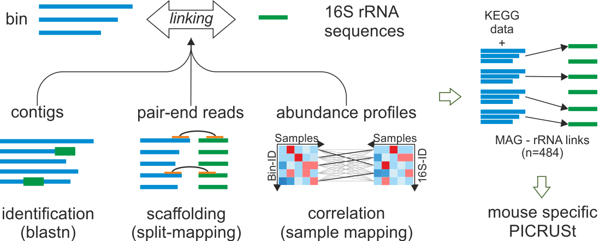

# Linking of reconstructed 16S rRNA genes to bins

## Table of Contents  
[Description](#Description)  
[Requirements](#Requirements)  
[Blast-search](#Blast-search)  
[Split-Mapping](#Split-Mapping)  
[Correlation](#Correlation)  
[Integration](#Integration)  

# Description

# Requirements

* [NCBI Blast](ftp://ftp.ncbi.nlm.nih.gov/blast/executables/blast+/LATEST/)
* [BBmap](https://sourceforge.net/projects/bbmap/)
* [R](https://cran.r-project.org)

# Blast-search

**1. Create Blast database with reconstructed 16S rRNA sequences from RAMBL**

	makeblastdb -type nucl -in RAMBL-16SrRNAsequences.fasta

**2. Run Blast for all bins ($BinFastaFile)**

	blastn \
	-query $BinFastaFile \
	-db RAMBL-16SrRNAsequences.fasta \
	-max_target_seqs 50 \
	-outfmt 6 \
	-evalue 0.000001 \
	-num_threads 20 \
	-out blastn-bins_Finals-full-nr99.50-hits-fasta.outfmt6
	
**3. Filter Blast results and create blast-summary-file**

* min ident 97%
* min coverage 100bp

under construction

# Split-Mapping

**1. Create BBmap index for all bins**

	bbsplit.sh ref=${Folder-of-all-bins}

**2. Run BBsplit to split each library into reads mapping to each bin**

    # for each Sample ($SampleName) with ReadR1 ($Fastq_R1) and ReadR2 ($Fastq_R2) we preform:
	mkdir splited-read-${SampleName}
	bbsplit.sh -Xmx80g usejni=t unpigz=t threads=24 minid=0.90 \
	ambiguous2=toss \
	in=${SampleName}_R1_rmhost.fastq.gz \
	in2=${SampleName}_R2_rmhost.fastq.gz \
	basename=./splited-read-${SampleName}/out_%.fastq.gz

**3. Map all mapped reads of a bin to all 16S rRNA sequences from RAMBL**

    mkdir statsfiles-unpaired-all scafstats-statsfiles-unpaired-all \
	cov-statsfiles-unpaired-all rpkm-statsfiles-unpaired-all
	# for each bin ($BinNr) we preform:
	zcat ./splited-read-*/out_bin_${BinNr}.fastq.gz | \
	bbmap.sh local=t -Xmx30g unpigz=t threads=${usedCores} minid=0.90 \
	ref=RAMBL-16sRNAsequences.fasta nodisk \
	interleaved=false \
	statsfile=./statsfiles-unpaired-all/${BinNr}.statsfile \
	scafstats=./scafstats-statsfiles-unpaired-all/${BinNr}.scafstats \
	covstats=./cov-statsfiles-unpaired-all/${BinNr}.covstat \
	rpkm=./rpkm-statsfiles-unpaired-all/${BinNr}.rpkm \
	sortscafs=f nzo=f ambiguous=all \
	in=stdin.fastq

**3. Summerize statistics**

under construction

# Correlation

**1. Create 16S rRNA gene abundances over all samples**

    # for each Sample ($SampleName) with ReadR1 ($Fastq_R1) and ReadR2 ($Fastq_R2) we preform:
    bbmap.sh -Xmx30g unpigz=t threads=${usedCores} minid=0.90 \
    ref=RAMBL-16sRNAsequences.fasta nodisk \
    statsfile=16SrRNA-statsfiles/${SampleName}.statsfile \
    scafstats=16SrRNA-scafstats-statsfiles/${SampleName}.scafstats \
    covstats=16SrRNA-cov-statsfiles/${SampleName}.covstat \
    rpkm=16SrRNA-rpkm-statsfiles/${SampleName}.rpkm \
    sortscafs=f nzo=f ambiguous=all local=t \
	in=${SampleName}_R1_rmhost.fastq.gz \
	in2=${SampleName}_R2_rmhost.fastq.gz

**2. Create bin abundances over all samples**

    # create conducted bin-fasta file from all bins in ${Folder-of-all-bins}
	mkdir bin-abundances
	cd bin-abundances
	for bin-file in ${Folder-of-all-bins}
	do
	BinFileName=${bin-file##*/}
	echo ">${BinFileName%.*}" >> bin-sequences.fasta
	fgrep -v ">" $bin-file >> bin-sequences.fasta
	done
	
	# create ref for bbmap
	bbmap.sh ref=bin-sequences.fasta
	
	# for each Sample ($SampleName) with ReadR1 ($Fastq_R1) and ReadR2 ($Fastq_R2) we preform:
	statsfile=bin-statsfiles/${SampleName}.statsfile \
    scafstats=bin-scafstats-statsfiles/${SampleName}.scafstats \
    covstats=bin-cov-statsfiles/${SampleName}.covstat \
    rpkm=bin-rpkm-statsfiles/${SampleName}.rpkm \
    sortscafs=f nzo=f ambiguous=all local=t \
	in=${SampleName}_R1_rmhost.fastq.gz \
	in2=${SampleName}_R2_rmhost.fastq.gz

**3. Summerize statistics**

under construction	

# Integration

under construction